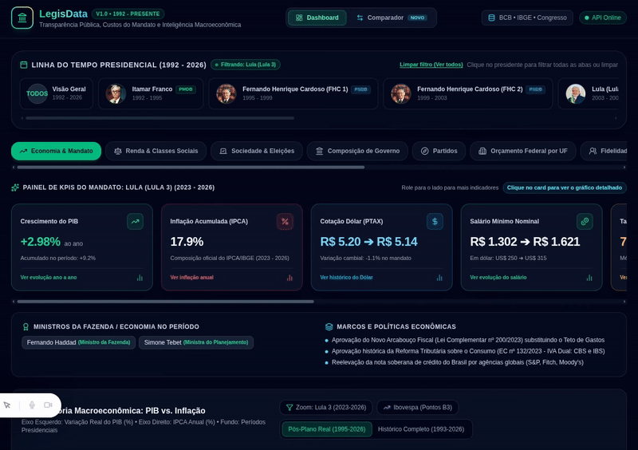

# LegisData

> **Plataforma Open-Source de Transparência e Inteligência Política**
>
> Arsenal cívico e de auditoria pública que cruza macroeconomia, indicadores socioambientais, votações nominais, financiadores de campanha (TSE), custos de gabinete (CEAP), emendas orçamentárias, o Basômetro governista e a relevância real das proposições legislativas.

[](https://nextjs.org/)
[](https://fastapi.tiangolo.com/)
[](https://www.postgresql.org/)
[](https://pandas.pydata.org/)
[](https://www.docker.com/)
[](https://github.com/)
[](LICENSE)

---

## 💡 Sobre o Desenvolvimento & Metodologia

> ### 🤖 Nota de Desenvolvimento (Vibe Coding)
> **Este projeto foi idealizado e arquitetado por mim, mas seu código-fonte foi integralmente desenvolvido através da metodologia de *Vibe Coding* (programação assistida por Inteligência Artificial / LLMs). A stack tecnológica utilizada (Python, FastAPI, Next.js, Prisma) não faz parte do meu domínio principal. Meu foco foi a engenharia de prompts, visão do produto de dados, regras de negócio e arquitetura da informação para criar uma plataforma robusta de transparência pública.**
>
> *Autor: Saulo Araujo Campos • Licenciado sob GNU AGPLv3*

---

## 📺 Demonstração da Plataforma

<p align="center">
  <a href="assets/LegisData.mp4" title="Clique para assistir ao tour completo de 6 minutos em alta resolução">
    
  </a>
  <br>
  <em>▶️ <b>Demonstração da plataforma em execução:</b> clique na animação acima para assistir ao tour completo em alta definição (<a href="assets/LegisData.mp4">Versão MP4</a> | <a href="assets/LegisData.webm">Versão WebM</a>).</em>
</p>

---

## 🎯 1. Propósito e Arsenal Cívico

O **LegisData** foi concebido como uma resposta técnica, visual e independente à polarização vazia e à desinformação no debate público brasileiro. Em vez de narrativas sem lastro empírico, a plataforma centraliza **dados abertos oficiais** de múltiplos órgãos de Estado para responder com rigor às principais perguntas do cidadão:

1. **Quem Paga a Conta? (Financiamento Eleitoral):** De onde veio o dinheiro que elegeu o parlamentar? Quais foram seus maiores doadores (partidos, fundos públicos e pessoas físicas)?
2. **O Basômetro (Adesão ao Governo):** O parlamentar vota alinhado com a base governista ou faz oposição sistemática nas matérias de interesse do Palácio do Planalto?
3. **Detector de Leis Inúteis (Taxa de Relevância):** O congressista atua em reformas econômicas e políticas públicas estruturais ou concentra o mandato em homenagens, títulos honorários e datas comemorativas?
4. **Custo do Mandato (Cota Parlamentar - CEAP):** Quanto o gabinete gasta em passagens aéreas, divulgação e locações, e quais empresas mais faturam com esses reembolsos?
5. **A Trilha do Dinheiro (Emendas Orçamentárias):** Para onde vão as emendas individuais, de bancada e Emendas PIX do parlamentar?
6. **Raio-X Judicial & Ficha Limpa:** Auditoria de certidões cíveis e criminais do TSE, STF e tribunais estaduais à luz da Lei Complementar nº 135/2010.
7. **Macropolítica e Indicadores Reais:** Cruzamento histórico da atuação política com PIB real, inflação (IPCA), taxa Selic, câmbio USD, salário mínimo, desigualdade (Gini), fome, desmatamento (INPE) e taxas de violência (IPEA/FBSP).

---

## 🏛️ 2. Fontes Abertas Oficiais

Todos os dados são coletados de forma rastreável por extratores dedicados (`User-Agent: LegisDataBot/1.0`), estritamente fundamentados na **Lei de Acesso à Informação (Lei nº 12.527/2011)**:

| Órgão / Instituição | Dados Coletados | Endpoint / Repositório Oficial |
| :--- | :--- | :--- |
| **TSE (Justiça Eleitoral)** | Prestações de contas eleitorais, doações de campanha, certidões judiciais e declarações de bens | Portal Dados Abertos TSE & DivulgaCandContas |
| **Câmara dos Deputados** | Deputados, mandatos, presenças, votos nominais, proposições e despesas da cota parlamentar (CEAP) | `dadosabertos.camara.leg.br/api/v2` |
| **Senado Federal** | Senadores, proposições legislativas, sessões deliberativas e cota parlamentar | `legis.senado.leg.br/dadosabertos` |
| **Banco Central do Brasil (BCB)** | Séries temporais de IPCA, taxa Selic, Câmbio USD PTAX e Dívida Líquida/PIB | Sistema Gerenciador de Séries Temporais (SGS) |
| **IBGE** | Contas Nacionais (PIB real), séries demográficas e desemprego (PNAD Contínua) | Banco de Dados SIDRA / Agregados API |
| **INPE** | Desmatamento anual consolidado na Amazônia Legal e Cerrado | Projeto PRODES / Plataforma TerraBrasilis |
| **IPEA & FBSP** | Séries históricas de segurança pública, taxas de homicídio e feminicídio | IpeaData & Fórum Brasileiro de Segurança Pública |

---

## 🛡️ 3. Funcionalidades e Pilares do LegisData

### 💰 1. Quem Paga a Conta? (Financiadores de Campanha)
- **Modelagem Relacional:** Tabela `doacoes_campanha` (`DoacaoCampanha` no SQLAlchemy / Prisma) com `politico_id`, `ano_eleicao`, `nome_doador`, `cpf_cnpj_doador`, `valor_doado` e `tipo_receita`.
- **Pipeline de Ingestão:** `etl/extractors/tse_doacoes_extractor.py` integrado à esteira do `db_loader.py`.
- **Interface no Dossiê (Raio-X):**
  - Card executivo exibindo a receita total de campanha e a quantidade de doadores.
  - Ranking e visualização gráfica dos **Top 5 Maiores Doadores** com percentual de concentração e tipo de receita (Fundo Eleitoral - FEFC, doações PF, recursos próprios).
  - Aba analítica dedicada com busca em tempo real e relação completa de todas as doações auditadas.

### 🧭 2. O Basômetro (Taxa de Alinhamento com o Governo)
- **Motor de Análise:** Algoritmo no backend que correlaciona o histórico de votos nominais (Sim/Não) com a orientação da liderança do governo e o baseline partidário governista na sessão.
- **Interface no Dossiê (Raio-X):**
  - Widget em destaque no cabeçalho: **"Taxa de Governismo: X% de alinhamento nas votações"**.
  - Barra de progresso horizontal graduada com gradiente térmico (Oposição Sistemática ↔ Independente ↔ Base Governista Fiel).
  - Indicadores quantitativos de votos alinhados vs votos divergentes em relação ao governo federal.

### 🔍 3. Detector de Leis Inúteis (Taxa de Relevância Legislativa)
- **Classificação Semântica:** O motor de análise textual examina as ementas das proposições de autoria do parlamentar:
  - **Simbólico:** Identifica homenagens, concessões de títulos honorários, dias comemorativos e denominações de rodovias e edifícios públicos.
  - **Impacto / Substancial:** Leis voltadas a reformas tributárias, macroeconomia, saúde, segurança pública, código penal e educação.
- **Interface no Dossiê (Raio-X):**
  - Painel analítico com **Gráfico de Pizza (Recharts Donut)**: **Projetos de Impacto (X%) vs Projetos Simbólicos (Y%)**.
  - Diagnóstico sintético da atuação parlamentar.
  - Filtros rápidos por relevância e campo de busca textual em ementas.

### 💳 4. Custo do Mandato (Cota Parlamentar - CEAP)
- Auditoria das notas fiscais da Cota para Exercício da Atividade Parlamentar (CEAP).
- Visualização por rubrica e identificação dos **Maiores Fornecedores** contratados pelo gabinete.

### 🗺️ 5. Trilha do Dinheiro (Emendas Orçamentárias)
- Mapeamento geográfico e orçamentário das emendas individuais, de comissão, de bancada e Emendas PIX enviadas para municípios e estados.

### ⚖️ 6. Raio-X Judicial e Ficha Limpa
- Badges de alerta de certidões judiciais com separação entre parlamentares com **Ficha Limpa (Nada Consta)** e parlamentares com processos em andamento.

---

## 🛠️ 4. Stack Tecnológica

- **Frontend:**
  - **Next.js 16 (App Router & Turbopack)** com TypeScript rigoroso.
  - **Tailwind CSS v4** com design system HSL escuro e alta fidelidade visual.
  - **Recharts 3.10** para gráficos de pizza, barras, séries temporais e comparadores.
  - **Lucide React** para iconografia técnica.
- **Backend:**
  - **Python 3.11+** com **FastAPI** assíncrono.
  - **Pydantic v2** para validação estrita de contratos de dados.
  - **SQLAlchemy 2.0** com connection pooling resiliente.
  - **CORS Middleware** com suporte local e produção Vercel.
- **Banco de Dados & ORM:**
  - **PostgreSQL 16** com mais de 23.000 registros e índices de concorrência.
  - **Prisma Schema** para padronização e migrações relacionais.
- **DevOps:**
  - **Docker** e **Docker Compose** para orquestração de banco de dados.
  - **Makefile** integrado para automação de tarefas.

---

## 🚀 5. Guia de Instalação e Execução Local

### Pré-requisitos
- **Git**
- **Docker** e **Docker Compose**
- **Python 3.11+**
- **Node.js 18+** ou **20+**

### Passo 1: Clonar o Repositório
```bash
git clone https://github.com/seu-usuario/legisdata.git
cd legisdata
```

### Passo 2: Subir o PostgreSQL via Docker
```bash
make up-db
```
*(Ou diretamente via Docker: `docker compose up -d postgres`)*

### Passo 3: Configurar o Ambiente Virtual Python
```bash
python3 -m venv .venv
source .venv/bin/activate
pip install --upgrade pip
pip install -r backend/requirements.txt -r etl/requirements.txt
```

### Passo 4: Executar a Carga Inicial do Banco de Dados
```bash
make run-load-db
```
*O pipeline executará as migrações, ingerindo séries históricas, parlamentares, cota CEAP, emendas, processos e as doações do TSE.*

### Passo 5: Iniciar o Backend (FastAPI)
```bash
make backend-dev
```
A API estará em execução em **`http://localhost:8000`**.
- Documentação Interativa (Swagger): `http://localhost:8000/docs`
- Documentação Alternativa (ReDoc): `http://localhost:8000/redoc`

### Passo 6: Iniciar o Frontend (Next.js)
Em outro terminal:
```bash
cd frontend
npm install
npm run dev
```
O portal estará disponível em **`http://localhost:3000`**.

---

## 🧪 6. Build de Produção

Para testar a compilação completa do frontend:
```bash
cd frontend
npm run build
```

---

## 📡 7. Principais Endpoints da API RESTful

| Método | Endpoint | Descrição |
| :--- | :--- | :--- |
| `GET` | `/api/v1/politicians` | Busca e listagem de políticos com filtros por cargo, partido e estado |
| `GET` | `/api/v1/politicians/{id}` | Dossiê completo: perfil, Basômetro, relevância de leis, doações e ficha limpa |
| `GET` | `/api/v1/politicians/{id}/doacoes` | Prestações de contas eleitorais e Top Doadores (TSE) |
| `GET` | `/api/v1/politicians/{id}/ceap` | Cota parlamentar: gastos por categoria e fornecedores contratados |
| `GET` | `/api/v1/politicians/{id}/emendas` | Emendas parlamentares pagas e municípios beneficiados |
| `GET` | `/api/v1/politicians/{id}/certidoes` | Certidões judiciais cíveis e criminais (Ficha Limpa) |
| `GET` | `/api/v1/economic/annual-summary` | Série histórica macroeconômica anual (PIB, IPCA, Dólar, Salário Mínimo) |
| `GET` | `/api/v1/analytics/mandates-performance` | Desempenho consolidado por mandato presidencial |
| `GET` | `/api/v1/analytics/compare-mandates` | Comparação normalizada de mandatos ($T_0 \dots T_n$) |
| `GET` | `/api/v1/analytics/party-fidelity` | Saldo líquido de bancadas e migrações partidárias |

---

## 📜 8. Licença e Transparência

Este projeto é software livre licenciado sob a [GNU Affero General Public License v3.0 (GNU AGPLv3)](LICENSE). Copyright (c) 2026 Saulo Araujo Campos. Todas as informações exibidas constituem patrimônio público acessível sob os ditames da Lei nº 12.527/2011 (LAI) e da legislação eleitoral brasileira.
